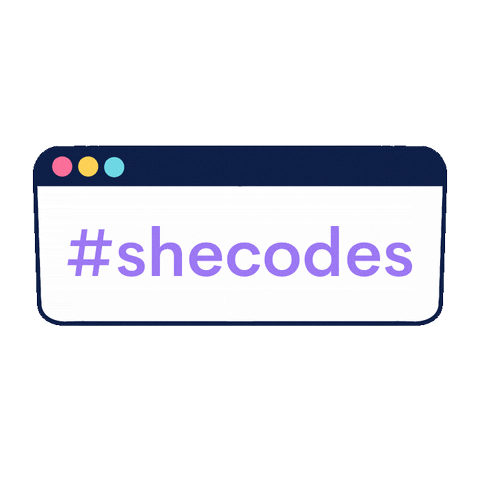

<h2>Hi there 👋, I'm Juliana Meneguete</h1>

<h4>A passionate web developer. </h4>
 
 

 

 You will find here the projects I have been developing since March/2021  when I oficially started my jorney in technology at <a href="https://driveneducation.com.br/" target="blank" style="text-decoration: none; color:purple">Driven Education</a>. Currently working as Software Engineer at <a href="https://br.linkedin.com/company/olx-brasil" target="blank" style="text-decoration: none; color:purple">OLX Brasil</a>. In 2024 I also decided to improve my knowledge in computer science by starting studies in this area at <a href="https://www.linkedin.com/school/universidade-federal-fluminense/" target="blank" style="text-decoration: none; color:purple">Federal Fluminense University</a> where I am currently studing.

 I have always believed that knowledge is the best way to improve everybody's quality of life. Initially I pursue this goal as a Chemistry Researcher, but I am quite sure that programming gives me the chance of creating great impact being more creative and generating results faster, that is my motivation to code and keep learning every day. 

---

<h3 align="left">Connect with me:</h3>

 
 &nbsp;  

  
 
 

 
:zap: <b>GitHub Stats</b>

 
:zap: <b>Most Used Languages</b>

---
---
